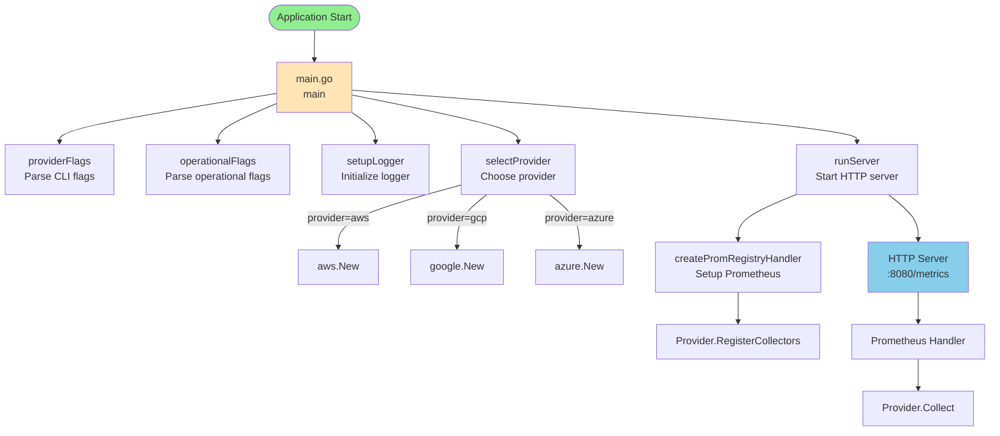
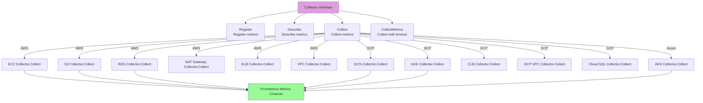
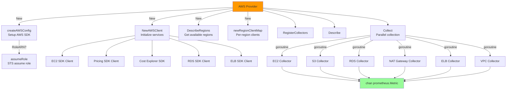
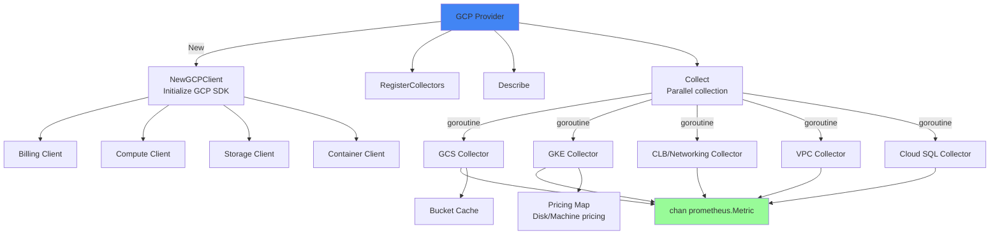
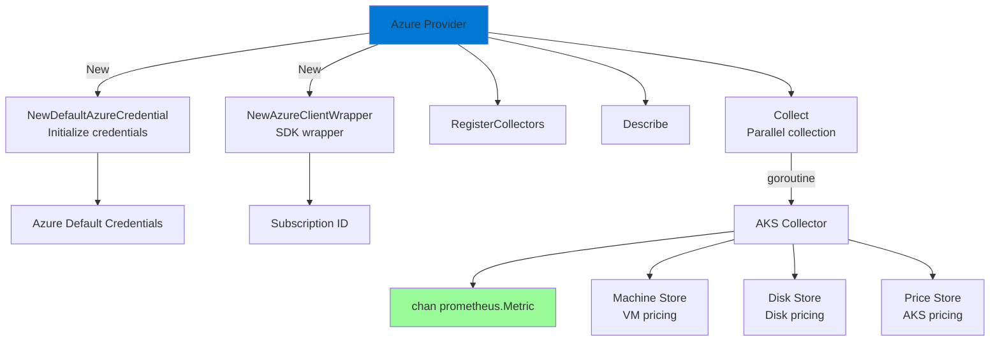
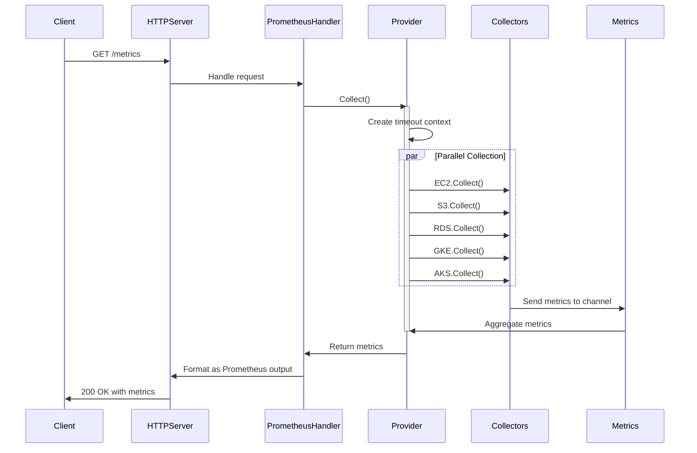
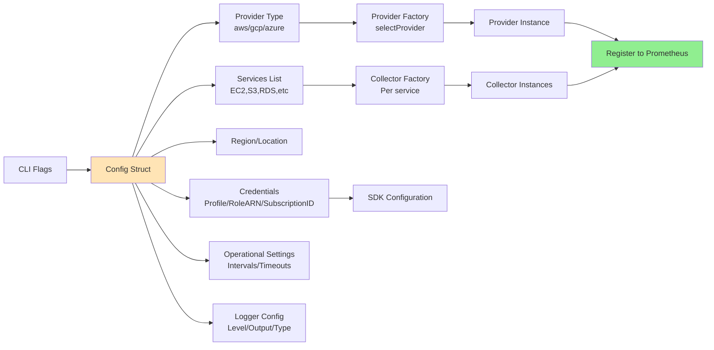

# CloudCost Exporter Call Diagram

This diagram shows the architecture and call flow of the cloudcost-exporter application.

## Main Application Flow

## Provider Architecture

```mermaid
graph TB
    Provider[Provider Interface<br/>prometheus.Collector] --> AWSProvider[AWS Provider]
    Provider --> GCPProvider[GCP Provider]
    Provider --> AzureProvider[Azure Provider]

    subgraph "AWS Provider"
        AWSProvider --> AWSClient[AWS Client<br/>SDK Wrapper]
        AWSProvider --> AWSS3[S3 Collector]
        AWSProvider --> AWSEC2[EC2 Collector]
        AWSProvider --> AWSRDS[RDS Collector]
        AWSProvider --> AWSNAT[NAT Gateway Collector]
        AWSProvider --> AWSELB[ELB Collector]
        AWSProvider --> AWSVPC[VPC Collector]

        AWSClient --> EC2Service[EC2 Service]
        AWSClient --> PricingService[Pricing Service]
        AWSClient --> BillingService[Cost Explorer]
        AWSClient --> RDSService[RDS Service]
        AWSClient --> ELBService[ELB Service]
    end

    subgraph "GCP Provider"
        GCPProvider --> GCPClient[GCP Client<br/>SDK Wrapper]
        GCPProvider --> GCS[GCS Collector]
        GCPProvider --> GKE[GKE Collector]
        GCPProvider --> CLB[Cloud LB Collector]
        GCPProvider --> GCPVPC[VPC Collector]
        GCPProvider --> CloudSQL[Cloud SQL Collector]

        GCPClient --> BillingAPI[Billing API]
        GCPClient --> ComputeAPI[Compute API]
        GCPClient --> StorageAPI[Storage API]
    end

    subgraph "Azure Provider"
        AzureProvider --> AzureClient[Azure Client<br/>SDK Wrapper]
        AzureProvider --> AKS[AKS Collector]

        AzureClient --> AzureCredentials[Azure Credentials]
        AzureClient --> ContainerAPI[Container Service API]
    end

    style Provider fill:#FFD700
    style AWSProvider fill:#FF9900
    style GCPProvider fill:#4285F4
    style AzureProvider fill:#0078D4
```

## Collector Pattern

## AWS Collector Detail

## GCP Collector Detail

## Azure Collector Detail

## HTTP Server Flow

## Configuration Flow

## Key Components Summary

### Entry Points
- `cmd/exporter/exporter.go` - Main application entry
- `main()` - Orchestrates setup and server start

### Core Packages
- `pkg/provider` - Provider interface definition
- `pkg/aws` - AWS provider implementation
- `pkg/google` - GCP provider implementation
- `pkg/azure` - Azure provider implementation
- `pkg/logger` - Logging utilities
- `pkg/utils` - Shared utilities

### Service Collectors
#### AWS
- `pkg/aws/s3` - S3 bucket metrics
- `pkg/aws/ec2` - EC2 instance metrics
- `pkg/aws/rds` - RDS database metrics
- `pkg/aws/natgateway` - NAT Gateway metrics
- `pkg/aws/elb` - Elastic Load Balancer metrics
- `pkg/aws/vpc` - VPC metrics

#### GCP
- `pkg/google/gcs` - Cloud Storage metrics
- `pkg/google/gke` - Kubernetes Engine metrics
- `pkg/google/networking` - Cloud Load Balancer metrics
- `pkg/google/vpc` - VPC metrics
- `pkg/google/cloudsql` - Cloud SQL metrics

#### Azure
- `pkg/azure/aks` - Azure Kubernetes Service metrics

### Client Wrappers
- `pkg/aws/client` - AWS SDK wrapper
- `pkg/google/client` - GCP SDK wrapper
- `pkg/azure/client` - Azure SDK wrapper

### Support Components
- `cmd/exporter/config` - Configuration management
- `cmd/exporter/web` - Web handlers
- Prometheus integration via `prometheus/client_golang`
