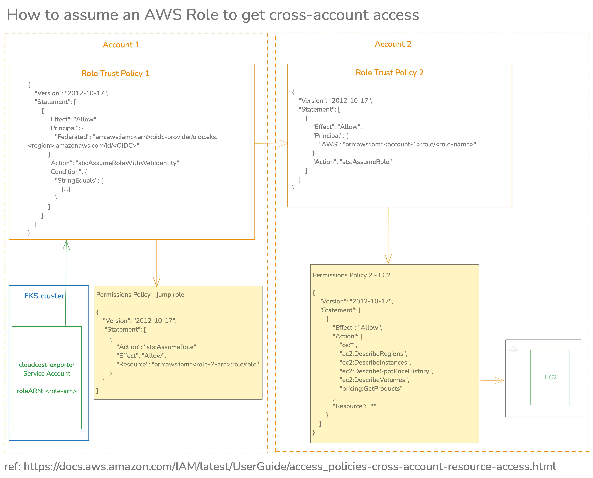

# AWS CloudCost Exporter Deployment

## Setup the required IRSA authentication

### 1. Setup the primary IAM role

cloudcost-exporter uses [AWS SDK for Go V2](https://docs.aws.amazon.com/sdk-for-go/v2/developer-guide/getting-started.html)
and supports providing authentication via the [AWS SDK's default credential provider chain](https://docs.aws.amazon.com/sdk-for-go/v1/developer-guide/configuring-sdk.html).
This means that the CloudCost Exporter can be deployed on an EC2 instance, ECS, EKS, or any other AWS service that supports IAM roles for service accounts.

First, create an IAM Policy the minimum required permissions for cloudcost-exporter to work on AWS, an example of which can be found in [./permissions-policy.json](./permissions-policy.json).

Next, [create and associate an IAM role for the cloudcost-exporter Service Account](https://docs.aws.amazon.com/eks/latest/userguide/associate-service-account-role.html).

The role ARN will be passed as an [annotation to the Service Account](#serviceaccountannotations-required) in the values file of the Helm chart.

The role's trust policy should look like this: [./role-trust-policy.json](./role-trust-policy.json).

>[!IMPORTANT]
> In the STS `Condition` element of the JSON policy, make sure that the Service Account name matches exactly the Service Account name that is deployed.
> For example, this could be as simple as `"system:serviceaccount:cloudcost-exporter:cloudcost-exporter"`.
> If using Helm to create a release such as `my-release`, the Service Account name should be updated to `"system:serviceaccount:cloudcost-exporter:my-release-cloudcost-exporter"`.

### 2. Configure the Helm chart

The Helm chart can be deployed after creating the necessary role and policy described above in [Authentication](#authentication).

An example values file with the additional AWS-specific values is provided here: https://github.com/grafana/helm-charts/blob/main/charts/cloudcost-exporter/values.aws.yaml

The AWS-specific values can also be set like this:
```console
helm install my-release grafana/cloudcost-exporter \
--set 'containerArgs[0]=--provider=aws' \
--set 'containerArgs[1]=--aws.region=us-east-1' \
--set 'containerArgs[2]=--aws.services=s3\,ec2' \
--set-string serviceAccount.annotations."eks\.amazonaws\.com/role-arn"="arn:aws:iam::123456789012:role/CloudCostExporterRole" \
--namespace cloudcost-exporter --create-namespace
```

### `containerArgs` (required)

Set AWS as the provider:
```
  - "--provider=aws"
```

Set the region that the client should authenticate with.
Check which region is used by the [AWS IAM endpoint](https://docs.aws.amazon.com/general/latest/gr/iam-service.html).
This is often a global endpoint so only needs to be set to one region.
```
  - "--aws.region=us-east-1"
```

Set which AWS service to use:
```
  - "--aws.services=s3,ec2"
```

### `serviceAccount.annotations` (required)

Annotate the `serviceAccount` with the ARN of the role created above.
This should look like the following:

```yaml
serviceAccount:
  annotations:
    eks.amazonaws.com/role-arn: arn:aws:iam::123456789012:role/CloudCostExporterRole
```

## Access resources in a separate account

There are two roles that cloudcost-exporter can use: the first one is the IRSA role, which is required.
The setup for this is described in the section [Setup the required IRSA authentication](#setup-the-required-irsa-authentication).
This is the role ARN that is added as a tag to the Service Account.
This authenticates cloudcost-exporter running in the cluster with the cluster's AWS account via OIDC.

cloudcost-exporter is also able to pull metrics from an account that is different to the account where the cluster is running.
This feature is **optional**.

The authentication setup involves the following (see AWS docs: [Cross-account access using roles](https://docs.aws.amazon.com/IAM/latest/UserGuide/access_policies-cross-account-resource-access.html#access_policies-cross-account-using-roles)):
* Set up the IRSA role in the cluster account
* Set up the role to be assumed in the account where resources will be accessed



Once the roles are setup, set the role ARN of the role to be assumed through the following flag: `--aws.roleARN=<role-arn>`

This can be added to the Helm configuration as an additional [containerArgs](#containerargs-required).

## Troubleshooting

### Issue with Service Account authentication

The following logs suggest that there is an error with the Service Account setup. Please double-check the docs above. Feel free to open an issue in the repository if you encounter any issues.

```
level=ERROR msg="Error selecting provider" message="error getting regions: operation error EC2: DescribeRegions, get identity: get credentials: failed to refresh cached credentials, failed to retrieve credentials, operation error STS: AssumeRoleWithWebIdentity, https response error StatusCode: 403, RequestID: <request-ID>, api error AccessDenied: Not authorized to perform sts:AssumeRoleWithWebIdentity" provider=aws
```
